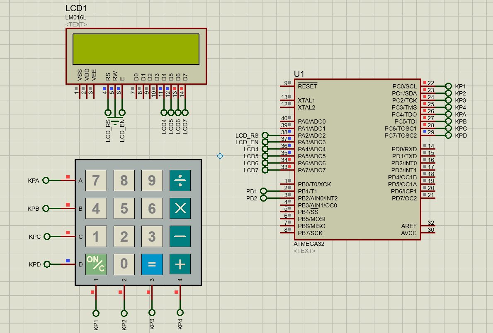
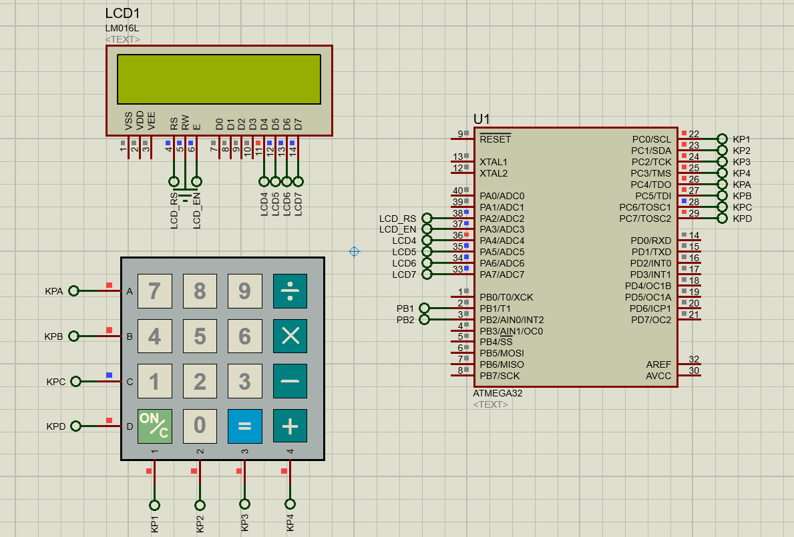

# Calculator APP
Calculator project that can work on variable number of digits

### Components/drivers Used  in this repo
* Atmega32
* LCD
* Keypad

## Demo
### Addition and division

### Subtraction and Multiplication

