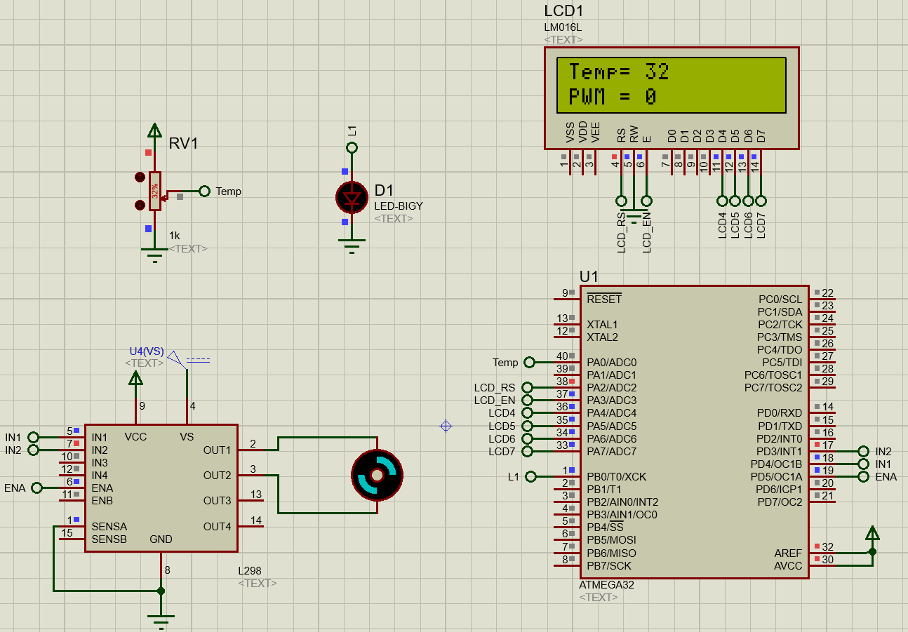

# Coolar System
Run a cooler (DC motor) with a speed which increased when temperature increased and will start to run if the temperature is greater than 35C

## System Components
* Atmega32
* DC Motor
* LCD
* LED
* Temp/potentiometer sensor

## Details
1. Motor and LED will be on when temperature is more than 35C and off when less than 35C
2. Temperature should be appeared on LCD first row
3. Cooler speed (duty cycle) should be appeared in second row
4. Cooler system is consists of 5volt DC motor, when the range of temperature is from 35c to 50c the cooler Dc volt should be from 2.5 to 5 volt

## Equation Used for mapping
The following equation is used to map the temp value to the pwm value.
'''
pwm_value = min_pwm + ((temp-min_temp)*(max_pwm-min_pwm))/(max_temp-min_temp) ;
'''

## Demo

